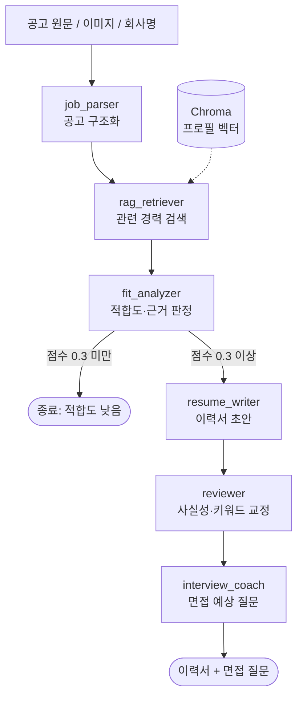
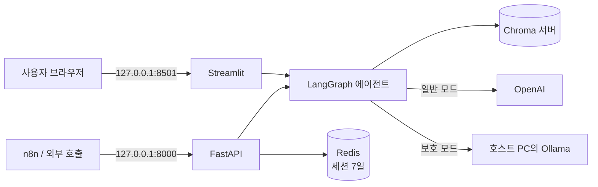

# GoodJob

[](https://github.com/sharppink/goodjob/actions/workflows/ci.yml)

채용공고와 내 경력을 비교해 **적합도를 점수로 매기고**, 충분히 맞으면 **그 공고에 맞춘 이력서**를 써 주는 AI 서비스입니다.
LangGraph 에이전트, RAG, sLLM 파인튜닝, 전체 로컬 처리(개인정보 보호 모드)를 한 프로젝트에서 다룹니다.

기술 선택은 가능한 한 **측정으로 결정**했습니다. 예를 들어 리랭커는 RAGAS로 재 보니 검색 품질을 떨어뜨려서 기본값에서 뺐고, 파인튜닝 모델은 로컬 비교 평가 결과에 맞춰 쓰임새를 정했습니다.

---

## 주요 기능

| 기능 | 설명 |
|---|---|
| **공고 분석** | 공고 원문·이미지·회사명 검색으로 공고를 받아 필수/우대 기술, 경력, 업무를 구조화 |
| **적합도 분석** | 경력에서 근거가 확인된 기술 / 근거 없는 기술을 나누고 0~1 점수와 보완 조언 제공 |
| **맞춤 이력서** | 공고 키워드에 맞춘 초안 → 자기검토 교정. 원문에 없는 회사·기간·수치는 쓰지 않음 |
| **면접 예상 질문** | 이력서 내용과 부족한 기술을 파고드는 질문 + 답변 전략 |
| **자소서 문항 작성** | 문항별 답변, 글자수는 코드로 세서 넘으면 다시 줄여 쓰기 |
| **STAR 경험 정리** | 자유롭게 적은 경험을 상황·과제·행동·결과로 정리, 빠진 정보는 질문으로 되물음 |
| **공고 추천** | 키워드로 공고를 모아 적합도 순으로 정렬 |
| **개인정보 보호 모드** | 프로필·이력서가 PC 밖으로 나가지 않도록 모든 LLM·임베딩을 로컬(Ollama)로 처리 |

---

## 아키텍처

### 에이전트 파이프라인 (LangGraph)



- 모든 노드는 `llm.factory.get_chat_client()`로 LLM을 받습니다. 일반 모드는 OpenAI(gpt-4o), 보호 모드는 로컬 Ollama를 돌려주므로 노드 코드는 모드를 몰라도 됩니다.
- 구조가 필요한 출력(공고 분석, 적합도, 면접 질문)은 Structured Output으로 받아 JSON 파싱 실패가 없습니다.

### 실행 구성 (docker compose)



- Streamlit은 API를 거치지 않고 에이전트를 직접 호출합니다. API는 n8n 같은 외부 자동화용입니다.
- 두 서비스가 같은 프로필을 보도록 Chroma를 **서버 모드**로 공유합니다 ([#024](#트러블슈팅)).

---

## 기술 스택과 선택 이유

| 영역 | 사용 기술 | 이유 |
|---|---|---|
| 에이전트 | LangGraph | 적합도에 따른 조건부 분기(조기 종료), 노드별 진행 상황 스트리밍 |
| LLM | OpenAI gpt-4o / gpt-4o-mini | Structured Output으로 형식 오류 없이 구조화, 이미지 공고는 Vision |
| 로컬 LLM | Ollama + Qwen2.5-7B, 파인튜닝 `goodjob-parser` | 8GB GPU에서 돌아가는 한국어 가능 모델, 보호 모드의 기반 |
| RAG | Chroma + OpenAI `text-embedding-3-small` (보호 모드는 `bge-m3`) | 설치가 가벼운 벡터 DB, 이력서 섹션 단위 청킹 |
| RAG 평가 | RAGAS | 검색 설정을 수치로 비교 (recall / precision / faithfulness) |
| 파인튜닝 | Unsloth QLoRA (Colab T4) → GGUF Q4_K_M | 무료 GPU로 7B 학습, 결과를 Ollama에서 바로 사용 |
| 검색·수집 | Tavily, Playwright | 회사·공고 검색, JS로 그려지는 공고 페이지 수집 |
| API / UI | FastAPI, Streamlit | 외부 연동용 REST API, 빠르게 만드는 대화형 UI |
| 운영 | Docker Compose, GitHub Actions, LangSmith, Redis | 한 줄 실행, PR마다 테스트·컨테이너 동작 확인, 에이전트 추적 |

---

## 측정 결과

### 1. RAG 검색 설정 비교 (RAGAS)

평가용 프로필 16청크, 질문 10개. 결과 파일: [`rag/eval_results/`](rag/eval_results)

| 설정 | context_recall | context_precision | faithfulness |
|---|---|---|---|
| **벡터 검색 top5 (채택)** | **0.90** | **0.91** | 0.81 |
| 벡터 + 리랭커 top5 | 0.65 | 0.82 | 0.94 |
| 벡터 검색 top3 | 0.70 | 0.88 | 0.84 |

리랭커(`bge-reranker-v2-m3`)를 켜면 recall이 **0.90 → 0.65**로 떨어졌습니다. 원인을 사례별로 확인해 보니, IT 이력서는 기술을 도구 이름으로 적는데(예: "Django REST Framework") 리랭커가 질문("Python 웹 프레임워크")과 도구 이름 사이의 관계를 잇지 못해 정답 청크를 밀어냈습니다. 그래서 **리랭커를 기본으로 끄기로 했습니다**. faithfulness는 리랭커 쪽이 높지만, 컨텍스트가 적어 답이 짧아진 영향이고 이력서에는 정보 누락이 더 치명적입니다.

### 2. 공고 파서 sLLM 파인튜닝 (gpt-4o → Qwen2.5-7B 증류)

- **방식:** 실제 채용공고 원문에 gpt-4o가 붙인 구조화 라벨을 정답으로, Qwen2.5-7B-Instruct를 QLoRA로 학습 (응답 기반 지식 증류, Alpaca와 같은 계열)
- **데이터:** 실제 공고 231건 (학습 208 / 평가 23), 중복·목록 페이지 정리
- **평가:** 이 PC(RTX 2060 SUPER 8GB)의 Ollama, JSON 모드, 같은 Q4_K_M 양자화끼리 비교. 수집 필터 누락으로 들어온 목록 페이지 2건 제외 21건 기준
  상세: [`finetune/results/local_eval_20261004.md`](finetune/results/local_eval_20261004.md)

| 지표 | 기본 qwen2.5:7b | 파인튜닝 goodjob-parser | 변화 |
|---|---|---|---|
| 우대 기술 F1 | 0.593 | **0.731** | +0.138 |
| 키워드 F1 | 0.487 | **0.592** | +0.105 |
| 경력 연수 정확도 | 0.810 | **0.905** | +0.095 |
| 필수 기술 F1 | 0.681 | 0.645 | −0.036 |
| JSON 형식 / 공고 판정 / 회사명 / 직무명 | 동일 | 동일 | = |
| 처리 속도 | 8.5초/건 | 7.6초/건 | |

**판단:** 우대 기술·키워드·경력 추출은 확실히 나아졌지만, gpt-4o 라벨 대비 기술 추출 F1은 아직 0.6~0.75 수준입니다. 그래서 앱 기본값은 OpenAI로 두고, 파인튜닝 모델은 **개인정보 보호 모드의 공고 파서**로 씁니다. 평가가 21건이라 한 건 차이가 약 0.05에 해당하므로, 작은 차이는 오차 범위로 봅니다.

### 3. 개인정보 보호 모드

OpenAI SDK가 생성 단계에서 실패하도록 막아 둔 상태로 전체 파이프라인(6노드)·STAR·자소서를 실행해 정상 동작을 확인했습니다(67초). OpenAI 클라이언트와 임베딩 호출 지점에 차단 장치(`PrivacyModeError`)가 있어, 로컬 전환을 놓친 경로가 있어도 데이터가 밖으로 나가지 않습니다. 로컬 7B 모델이라 문장 품질과 속도는 gpt-4o보다 떨어집니다.

---

## 트러블슈팅

개발 중 겪은 문제 24건을 [`PROJECT_DOCS.txt`](PROJECT_DOCS.txt) 0장에 원인·해결·교훈 형식으로 기록했습니다. 그중 대표 사례입니다.

| # | 문제 | 원인 | 해결 |
|---|---|---|---|
| **#007** | 이력서에 가짜 회사·수치가 생성됨 (환각) | 프롬프트가 아니라 **RAG 청킹 버그**. `Experience: 스타트업 A …`처럼 헤더와 내용이 한 줄이면 내용을 버려 경력이 DB에 아예 없었음 | 청킹 수정 + 사실성 규칙 + few-shot 교체. 프롬프트만 고쳤을 땐 일부만 나아졌고, 검색 결과를 직접 출력해 보고서야 근본 원인을 찾음 |
| **#008** | 프로젝트 경험이 적합도 분석에서 누락 | 쿼리 4개가 모두 같은 상위 3청크만 반환 | 12청크 이하 작은 프로필은 검색 없이 전체 사용 (한 장짜리 이력서는 걸러낼 이유가 없음) |
| **#010** | 리랭커가 검색 품질을 떨어뜨림 | 도구 이름 ↔ 분야 연결을 못 함 (위 측정 결과) | 측정 근거로 기본 비활성. 처음엔 라이브러리 버그를 의심했으나 토큰화·로짓을 직접 확인해 배제 |
| **#009** | 평가 스크립트가 실제 프로필 DB를 덮어씀 | import 순서 때문에 환경변수로 바꾼 경로가 무시됨 + 클라이언트가 첫 경로에 고정 | 저장소를 명시적으로 주입, 실제 DB 경로면 중단하는 가드. 테스트에도 같은 가드 적용 |
| **#020** | 파인튜닝 후 공고 판정 점수가 하락 | 오답을 하나씩 보니 전부 평가 데이터의 **목록 페이지 1건**, 라벨이 틀렸고 모델 판단이 오히려 맞음 | 수집 필터 보완, 해당 데이터 제외 후 재계산. 평균만 보지 말고 오답 사례를 볼 것 |
| **#024** | 두 프로세스가 같은 벡터 DB를 쓰면 검색 실패 | Chroma 로컬 파일 모드는 단일 프로세스 전용 (count는 보이지만 검색은 hnsw 오류) | Chroma 서버 모드 지원 (`CHROMA_HOST`), compose에서 API·Streamlit이 서버 공유. 로컬 재현 후 CI에서 컨테이너 간 검색 확인 |

---

## 실행 방법

### 1. 환경 변수

```bash
cp .env.example .env   # OPENAI_API_KEY (필수), TAVILY_API_KEY (회사 검색·추천), LANGCHAIN_API_KEY (선택)
```

### 2-A. Docker (권장)

```bash
docker compose up -d --build
```

- Streamlit: http://localhost:8501 / API 문서: http://localhost:8000/docs
- 포트는 이 PC(127.0.0.1)에서만 열립니다. `.env`는 이미지에 들어가지 않고 실행할 때만 읽습니다.
- 프로필 DB는 `./chroma_db`에 저장됩니다. 로컬 실행과 같은 DB이므로 **컨테이너와 로컬 앱을 동시에 띄우지 마세요**.
- 이미지에는 로컬 BGE 임베딩·리랭커용 패키지(torch)를 넣지 않았습니다. 기본 설정과 보호 모드에는 영향이 없습니다.

### 2-B. 로컬 (Python 3.10)

```bash
python -m venv .venv
.venv\Scripts\activate          # macOS/Linux: source .venv/bin/activate
pip install -r requirements.lock.txt      # 검증된 버전 고정본
playwright install chromium

streamlit run frontend/app.py               # UI
uvicorn api.main:app --port 8000            # API (선택)
```

UI와 API를 동시에 띄울 때는 Chroma 서버를 먼저 실행하고 `.env`에 `CHROMA_HOST=localhost`, `CHROMA_PORT=8001`을 설정하세요.

```bash
chroma run --path ./chroma_db --port 8001
```

### 3. 개인정보 보호 모드 (선택)

[Ollama](https://ollama.com) 설치 후 모델을 받고, Streamlit 사이드바의 **🔒 개인정보 보호 모드**를 켭니다.

```bash
ollama pull qwen2.5:7b
ollama pull bge-m3
# 파인튜닝 파서(선택): GGUF 파일을 finetune/ollama/goodjob-parser.Q4_K_M.gguf 로 두고
ollama create goodjob-parser -f finetune/ollama/Modelfile
```

`goodjob-parser`가 없으면 공고 파싱도 `qwen2.5:7b`로 처리합니다. GGUF 파일(4.4GB)은 저장소에 포함하지 않으며, [`finetune/colab_finetune.ipynb`](finetune/colab_finetune.ipynb)로 직접 학습할 수 있습니다.

### 4. 테스트

```bash
pip install -r requirements-dev.txt
pytest
```

- 121개, 약 12초. LLM·임베딩은 가짜 객체, 벡터 DB는 테스트마다 임시 폴더를 써서 **API 키 없이, 비용 없이** 돌아갑니다.
- 외부 네트워크 접속을 막고, 실제 `chroma_db`를 가리키면 테스트를 중단하는 안전장치가 있습니다.
- 루트의 `test_*.py`는 실제 API를 호출하는 수동 확인 스크립트이며 pytest 대상이 아닙니다.

GitHub Actions가 PR과 `main` 푸시마다 pytest와 Docker 빌드·기동·동작 확인(컨테이너 간 벡터 공유, 한국어 PDF, Chromium)을 실행합니다.

---

## API

| 메서드 | 경로 | 설명 |
|---|---|---|
| POST | `/profile/upload` | PDF 이력서 업로드 → 벡터 DB 저장 |
| POST | `/profile/manual` | 프로필 직접 입력 (JSON) |
| GET | `/profile/status` | 저장된 프로필 청크 수 |
| POST | `/company/search` | 회사명으로 공고 검색 (Tavily) |
| POST | `/company/image` | 공고·로고 이미지 분석 (OpenAI Vision) |
| POST | `/resume/generate` | 공고 텍스트 또는 URL → 적합도·이력서·면접 질문 |
| GET | `/resume/{session_id}` | 생성 결과 다시 조회 (Redis 7일 보관) |
| POST | `/recommend` | 키워드로 공고 추천 |

n8n 워크플로우 3종(프로필 등록 웹훅, 매일 공고 알림, 이력서 생성)은 [`n8n/workflows/`](n8n/workflows)에 있습니다.

---

## 프로젝트 구조

```
agents/      LangGraph 노드 (공고 파싱, RAG 검색, 적합도, 이력서, 교정, 면접, 추천, STAR, 자소서)
rag/         Chroma 저장소, 임베딩, 프로필 청킹, 리랭커, RAGAS 평가
llm/         OpenAI / Ollama 클라이언트, 모드별 클라이언트 선택, 라우터
search/      Tavily 검색, Playwright 수집, 이미지 공고 분석
api/         FastAPI 라우트, Redis 세션 저장소
frontend/    Streamlit UI, 이력서 PDF 출력
finetune/    학습 데이터 수집·라벨링, Colab 학습 노트북, 평가 지표, 결과
config/      환경 변수 설정, LangSmith 추적
tests/       pytest (외부 API·실제 DB 미사용)
n8n/         n8n 워크플로우
```

---

## 한계와 다음 단계

- **평가 규모가 작습니다.** 파인튜닝 평가 21건, RAGAS 질문 10개입니다. 설정 간 비교에는 쓸 수 있지만 절대 수치로 일반화하기는 어렵습니다.
- **학습 데이터가 목표의 절반 이하입니다.** Tavily 개발 키 사용량 한도로 수집이 299건(정리 후 231건)에서 멈췄습니다. 학습 데이터에 남은 목록 페이지 13건을 정리한 뒤 재학습할 계획입니다.
- **필수 기술 추출은 파인튜닝 후 소폭 하락**(−0.036)했습니다. 오차 범위로 보지만 데이터를 늘려 다시 확인이 필요합니다.
- **복합 질문 검색:** "자격증과 인프라 자동화"처럼 두 주제를 묻는 질문은 모든 설정에서 recall 0이었습니다. 쿼리 분해를 검토 중입니다.
- n8n 워크플로우는 JSON 구조와 API 응답 형식까지 검증했고, n8n 앱 안에서 실행해 보지는 않았습니다.

---

전체 개발 기록(기능별 구현 내용, 기술별 장단점, 문제 기록 24건)은 [`PROJECT_DOCS.txt`](PROJECT_DOCS.txt)에 있습니다.
